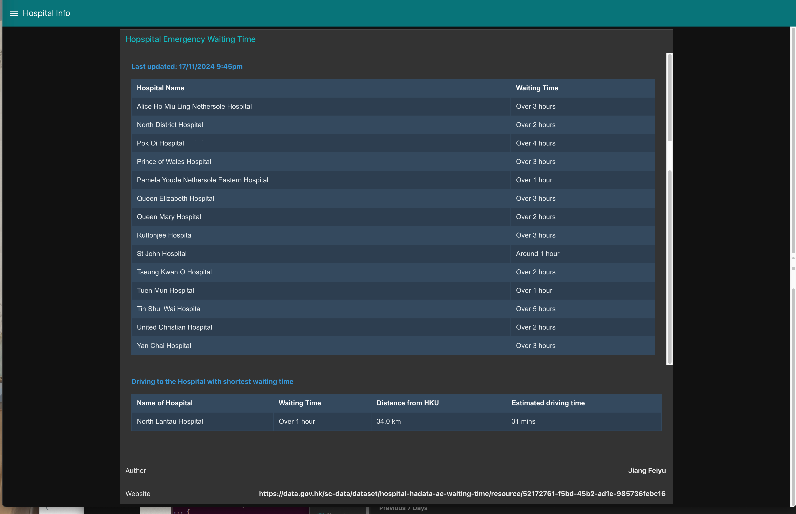
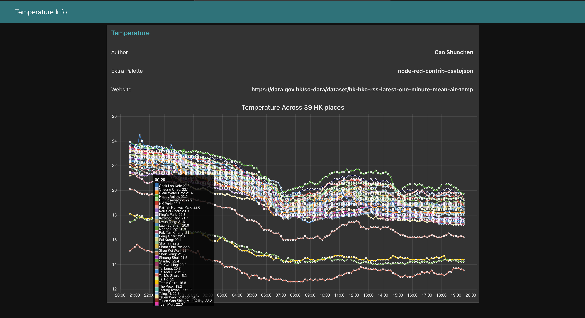
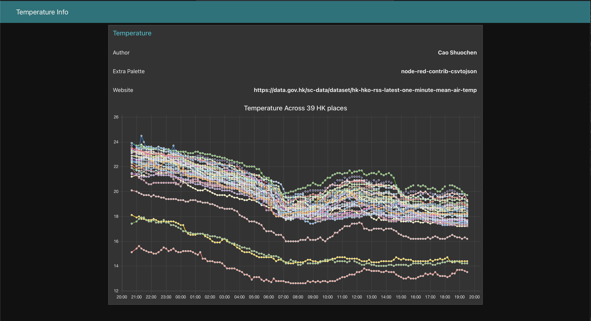
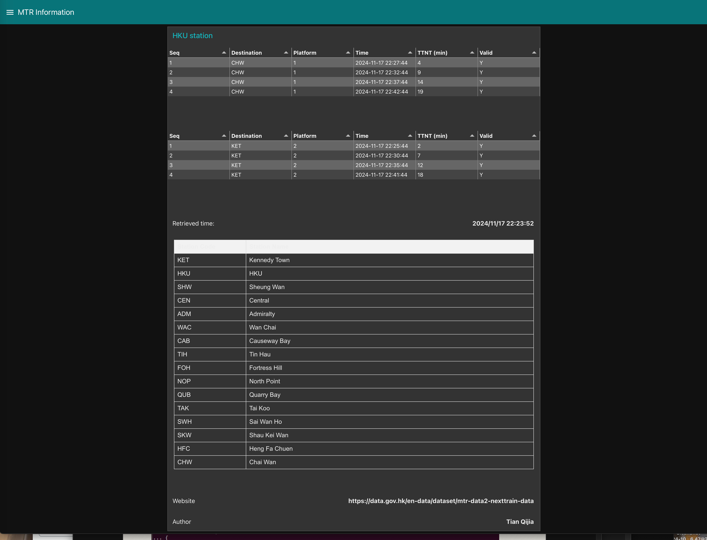
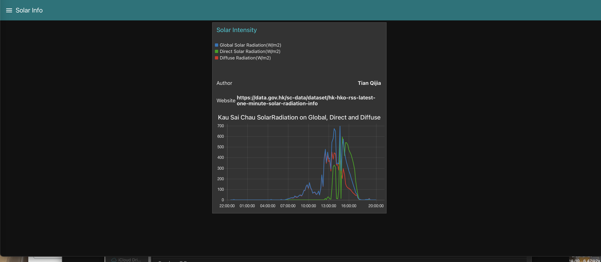
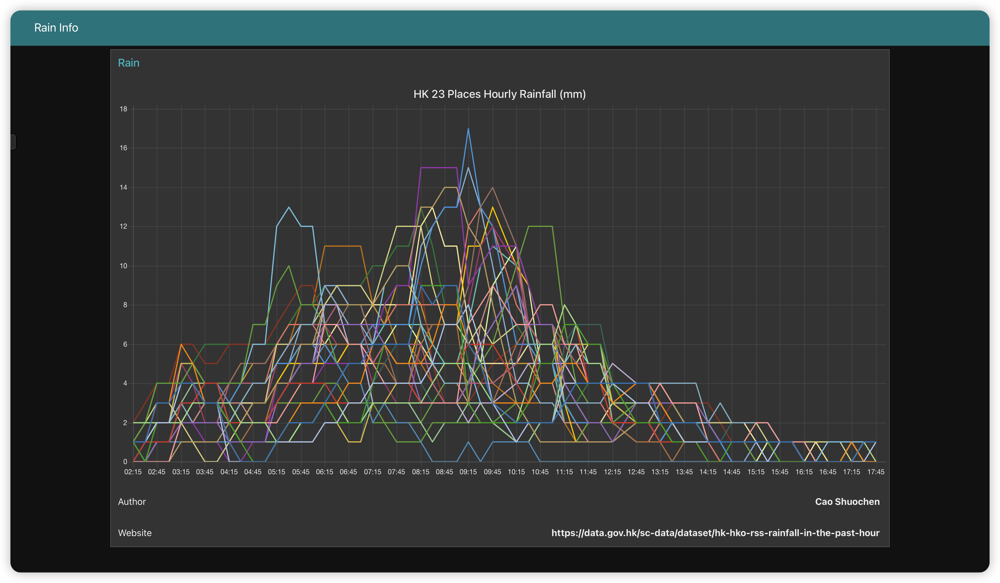
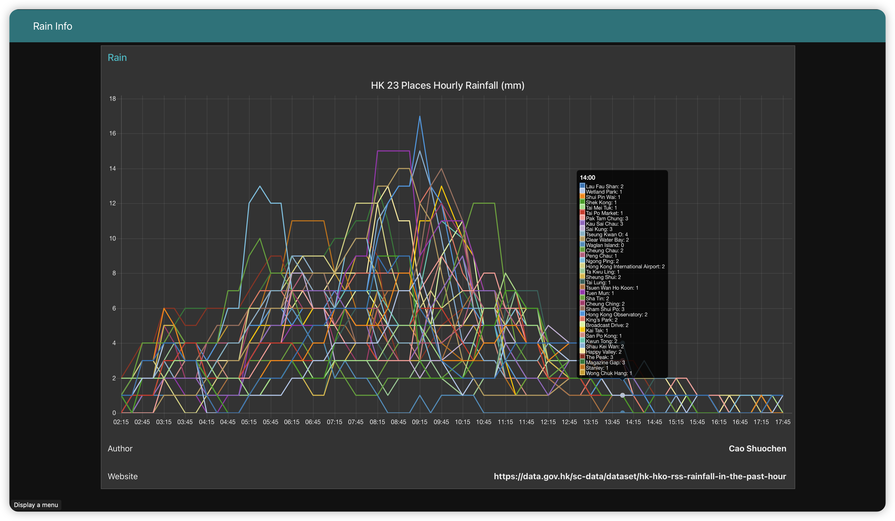

## Introduction

As urbanization accelerates, cities face increasingly severe challenges, including traffic congestion, environmental pollution, and public health issues. To address these challenges, many cities are turning to smart city solutions that leverage data-driven technologies to enhance the efficiency of urban management and improve the quality of life for residents. This project aims to explore how the integration of meteorological, healthcare, and transportation data can be utilized through data analysis and visualization to create smarter urban management strategies.
A smart city is defined as an urban area that utilizes information and communication technology (ICT) and the Internet of Things (IoT) to enhance the services, infrastructure, and governance capabilities of the city (James et al., 2020). By collecting, analyzing, and sharing data, smart cities can better respond to the needs of residents, improve resource utilization, and promote sustainable development.
The primary purpose of this report is to provide a detailed overview of our applications in the smart city domain, showcasing the implementation of data analysis and visualization, as well as the key insights presented through dashboards. In this project, we provide visual analysis for smart cities by obtaining real-time healthcare, meteorological, and transportation data within the Node-RED framework. This framework facilitates real-time insights for urban managers and reflects development trends, maximizing the efficient allocation of urban resources to meet the needs of residents.

## Smart City Use Cases

| Use Case                                | Category      | Insights                                                                                                                                                                                                                                                                                                                                                                                                                               |
| --------------------------------------- | ------------- | -------------------------------------------------------------------------------------------------------------------------------------------------------------------------------------------------------------------------------------------------------------------------------------------------------------------------------------------------------------------------------------------------------------------------------------- |
| Hospital Emergency Waiting Time         | Public Health | The waiting times in hospitals can facilitate balanced load distribution among various hospitals, enhancing the efficiency of emergency care. We combine hospital addresses with the Google Maps API to display real-time driving time and distance to the nearest emergency department with the shortest waiting times from HKU (the default starting point). This allows patients to plan in advance and reduce their waiting times. |
| MTR HKU station waiting time            | Traffic       | This helps alleviate traffic pressure, disperse crowds, enhance efficiency, and reduce the risk of trampling incidents; it also assists people in planning their travel during peak times                                                                                                                                                                                                                                              |
| Raining Information                     | Meteorology   | Helps in predicting and managing potential flooding events.  Enables timely alerts for residents regarding severe weather conditions.                                                                                                                                                                                                                                                                                                  |
| Solar Information (sunshine conditions) | Meteorology   | Assists in optimizing the use of solar energy systems by predicting solar power generation.  Aids in designing buildings and green spaces that maximize natural light and minimize heat islands.  Provides insights into outdoor activity patterns, promoting public health initiatives based on sunshine availability.                                                                                                                |
| Temperature Information                 | Meteorology   | Supports public health responses to extreme temperature conditions, particularly for vulnerable populations. Helps in predicting energy demand for heating and cooling, leading to more efficient energy distribution.                                                                                                                                                                                                                 |

## Technical Framework

*Node-RED* is a flow-based programming tool that allows users to wire together devices, APIs, and online services. It enables real-time data processing and visualization through an intuitive interface.

*MongoDB* is a NoSQL database that stores data in flexible, JSON-like documents. It is well-suited for handling large volumes of unstructured data, making it ideal for applications that require scalability and quick access to diverse data types.

The process begins with the acquisition of data streams from various sources, such as APIs or Excels from <https://data.gov.hk/>. Once the data is retrieved, it undergoes processing to clean, filter, and transform it into a usable format.  The processed data is then stored in a database or data storage system, ensuring it is organized and easily accessible. After storage, specific data can be extracted as needed for analysis or reporting purposes. Finally, the extracted data is visualized through dashboards or other graphical representations, providing insights for decision-making.

## Data Stream Retrieval

| Content                                                                                                                     | API                                                                                                                 |
| --------------------------------------------------------------------------------------------------------------------------- | ------------------------------------------------------------------------------------------------------------------- |
| Accident and Emergency Waiting Time by Hospital (CSDI Portal)                                                               | <https://data.gov.hk/en-data/dataset/hospital-hadata-ae-waiting-time/resource/2aeb0b58-ba3d-453e-a6ab-05f96a821308> |
| Real-time MTR train information                                                                                             | <https://data.gov.hk/en-data/dataset/mtr-data2-nexttrain-data>                                                      |
| Rainfall in the past hour from Automatic Weather Station                                                                    | <https://data.gov.hk/en-data/dataset/hk-hko-rss-rainfall-in-the-past-hour>                                          |
| Regional weather in Hong Kong – the latest 1-minute global solar radiation and direct solar radiation and diffuse radiation | <https://data.gov.hk/en-data/dataset/hk-hko-rss-latest-one-minute-solar-radiation-info>                             |
| Regional weather in Hong Kong – the latest 1-minute mean air temperature                                                    | <https://data.gov.hk/en-data/dataset/hk-hko-rss-latest-one-minute-mean-air-temp>                                    |

It is important to note that we used the *Google Maps API* to calculate travel times, so please replace your API key in the corresponding variable (as shown below). You could refer to the Google Map Docs for instruction. Moreover, you should install *node-red-contrib-csvtojson* palette to go through the temperature flow and Dashboard.

## Data Storage and Extraction

*Accident and Emergency Waiting Time by Hospital (CSDI Portal)*

*   Data Storage: The database only stores new records comparing the latest records.
*   Data Extraction: The database extracts the latest record to show in the dashboard.

<!---->

    {
        "hospital_id": "医院ID",
        "waiting_time": {
            "adult": "成人等待时间",
            "child": "儿童等待时间"
        },
        "timestamp": "记录时间"
    }

*Rainfall in the past hour from Automatic Weather Station*

*   Data Storage: The database only stores new records comparing the latest records.
*   Data Extraction: The database extracts the latest 24 hours records to show in the dashboard.

<!---->

    {
        "location": "位置",
        "rainfall": {
            "current": "当前降雨量",
            "forecast": "预报降雨量"
        },
        "timestamp": "记录时间"
    }

*Real-time MTR train information*

*   Data Storage: Since the API updates every 10 seconds and http requests occur every 1 minute, the database store it directly without checking redundancy.
*   Data Extraction: The database extracts the latest record to show in the dashboard.

<!---->

    {
        "station": "HKU",
        "up_trains": [
            {
                "seq": "列车序号",
                "destination": "目的地",
                "platform": "站台",
                "time": "到达时间",
                "ttnt": "预计等待时间（分钟）"
            }
        ],
        "down_trains": [
            {
                "seq": "列车序号",
                "destination": "目的地",
                "platform": "站台",
                "time": "到达时间",
                "ttnt": "预计等待时间（分钟）"
            }
        ],
        "timestamp": "记录时间"
    }

*Regional weather in Hong Kong – the latest 1-minute global solar radiation and direct solar radiation and diffuse radiation*

*   Data Storage: The database only stores new records comparing the latest records.
*   Data Extraction: The database extracts the latest 24 hours records to show in the dashboard.

<!---->

    {
        "location": "位置",
        "solar_data": {
            "global_radiation": "全球辐射量（瓦特/平方米）",
            "direct_radiation": "直接辐射量（瓦特/平方米）",
            "diffuse_radiation": "漫射辐射量（瓦特/平方米）"
        },
        "timestamp": "记录时间"
    }

\*Regional weather in Hong Kong – the latest 1-minute mean air temperature \*

*   Data Storage: The database only stores new records comparing the latest records.
*   Data Extraction: The database extracts the latest 24 hours records to show in the dashboard.

<!---->

    {
        "location": "位置",
        "temperature": {
            "current": "当前温度",
            "max": "最高温度",
            "min": "最低温度"
        },
        "timestamp": "记录时间"
    }

## Dashboard

**Hospital Table - Hospital Emergency Waiting Time**: The 1st table columns are hospital name and waiting time. The 2nd table is the hospital info with the lowest wating time. The columns are hospital name, wating time, the distance from HKU and the extimated driving time.

**Temperature Line Chart – Hong Kong 39 Places**:
The ordinate of this line chart represents degrees Celsius, while the abscissa represents time. The second figure shows the details of 39 automatic weather stations with their temperature.

**MTR Table - MTR HKU station waiting time**: The 1st and 2nd tables display the waiting times for the next MTR at HKU station in different directions. The 3rd table provides the station abbreviations.

**Solar Line Chart– Kau Sai Chau Solar Radiation**: The ordinate of this line chart represents W/m², while the abscissa represents time.

**Raining Line Chart – Hong Kong 23 Places Hourly Rainfall**: The ordinate of this line chart represents the rainfall in millimeters, while the abscissa represents time.

The interface demonstrates a sophisticated blend of form and function in its UI design and data visualization. Through thoughtful implementation of contrasting colors - including dark themes offset by vibrant accents - the design optimizes readability while minimizing eye fatigue. The content structure employs an intuitive tab-based navigation system, effectively segmenting distinct data categories such as hospital metrics, transit updates, solar readings, and temperature measurements. Users benefit from dynamic functionality through automated 60-second data refreshes, ensuring continuous access to current information. The interface's effectiveness is further enhanced by its typography choices and structured tabular layouts, resulting in a refined and accessible user experience.

## Limitations

While our project demonstrates the potential of smart city data integration, several significant limitations should be acknowledged:

*   **Data Infrastructure Constraints**: Our system relies primarily on publicly available APIs and basic data sources. A true smart city requires an extensive network of IoT sensors, real-time data collection points, and sophisticated monitoring systems
*   **Computational Resources**: Our demonstration operates on a relatively small scale compared to the massive cloud computing infrastructure required for actual smart city operations. The actual implementation would need to handle complex integration challenges across different municipal departments, private sector systems, and public infrastructure.
*   **Scale and Scope**: The current implementation focuses on select aspects of urban management, while a comprehensive smart city solution would need to address numerous additional domains such as: energy grid management, waste management systems, public safety and security, etc.
*   **Security and Privacy Considerations**: Our implementation does not fully address the complex security and privacy requirements that would be necessary for handling sensitive urban data.

## Innovation Hight lights

*   **Multi-dimensional Data Integration**: Understanding that a smart city is a complex system, we selected real-time data from multiple sectors including meteorology, transportation, and public health to create a comprehensive abstraction that effectively quantifies and reflects actual urban operations.
*   **Interactive Data Analysis Expanding Interpretative Scope**: By linking Google Maps traffic conditions with hospital emergency waiting times, we enable richer urban application scenarios. For instance, an emergency command center could utilize our system to determine the optimal hospital destination for patients, ensuring the quickest possible treatment. This is just one example of how we aim to facilitate multi-dimensional data interpretation.
*   **Deployment**: We have prepared Docker files compatible with both Linux and Mac environments, ensuring robust adaptability across different platforms.

## Conclusion

This project demonstrates a comprehensive approach to smart city data integration and visualization, successfully combining real-time information from healthcare, transportation, and meteorological sectors. Through the implementation of Node-RED and MongoDB, we have created a robust system that not only collects and processes data but also presents it in an intuitive and actionable format. Furthermore, the project's technical implementation, including Docker compatibility across different operating systems, ensures broad accessibility and ease of deployment. The modular design of our system allows for future expansions and adaptations as smart city needs evolve. Looking ahead, this framework could serve as a foundation for more sophisticated urban management solutions, potentially incorporating additional data sources and advanced analytics capabilities. The successful implementation of this project demonstrates the viability of integrated data systems in supporting informed decision-making for smart city management.

## Reference

James, P., Astoria, R., Castor, T., Hudspeth, C., Olstinske, D., & Ward, J. (2020). Smart cities: Fundamental concepts. In Handbook of smart cities (pp. 1–26). Springer International Publishing. <https://doi.org/10.1007/978-3-030-15145-4_2-1>
